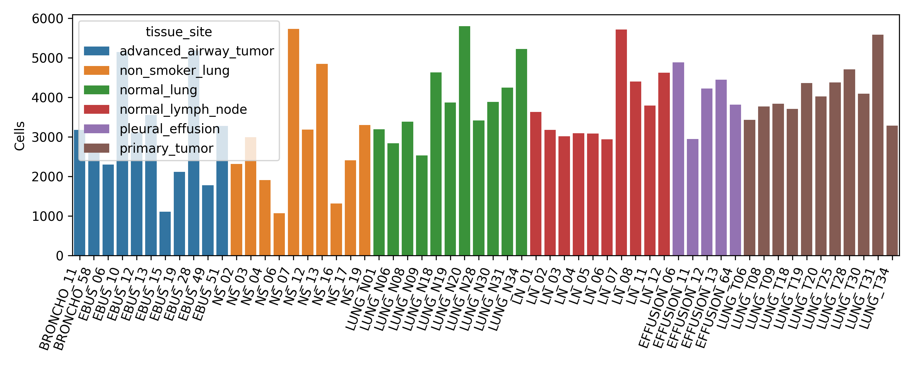
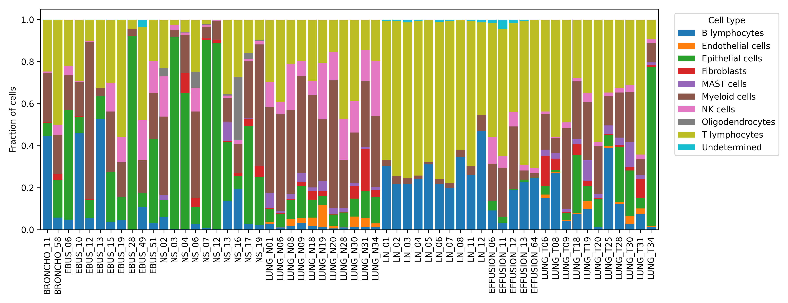
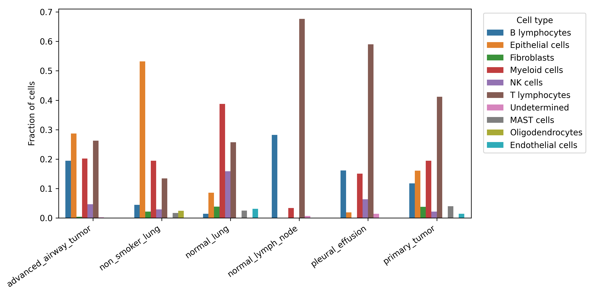

# Sample-Aware Reanalysis of Lung Adenocarcinoma Tumor Microenvironment scRNA-seq

This repository contains a reproducible reanalysis workflow for GEO dataset `GSE131907`, a human lung adenocarcinoma single-cell RNA-seq atlas containing 208,506 cells from 58 samples across normal lung, primary tumors, lymph nodes, metastatic sites, and malignant pleural effusions.

Unlike a direct reproduction of the original atlas, this project is framed as a compact, sample-aware tumor microenvironment analysis:

- tissue-site and sample-level cell composition
- immune exhaustion and cytotoxicity programs
- myeloid inflammatory and macrophage-like programs
- epithelial malignancy, EMT, hypoxia, proliferation, and stress signatures
- optional benchmarking hooks for annotation/scoring methods

## Biological Question

How do tumor microenvironment programs vary across lung adenocarcinoma tissue contexts, including normal lung, primary tumor, lymph node, metastatic brain tissue, and malignant pleural effusion?

## Why This Dataset

GEO reports that `GSE131907` contains scRNA-seq profiles from 58 lung adenocarcinoma-related samples from 44 patients, including tumor, normal lung, normal lymph node, metastatic brain tissue, EBUS/bronchoscopy tumor samples, and pleural fluid. GEO provides processed expression matrices and cell annotations; raw sequencing files are not openly available because of patient privacy restrictions.

This makes the dataset useful for a portfolio project because it is large enough to support sample-aware summaries but still public and reproducible from GEO supplements.

## What This Reanalysis Adds

The original study already describes a detailed LUAD single-cell atlas. This repository focuses on a different, compact analysis layer:

- standardized metadata extraction from GEO cell annotations
- sample/tissue-site-level composition summaries
- clinically interpretable TME signatures
- broad malignant/immune/stromal compartment summaries
- reproducible scripts suitable for a GitHub portfolio
- explicit limitations around reuse of processed public data

## Data

GEO accession: [GSE131907](https://www.ncbi.nlm.nih.gov/geo/query/acc.cgi?acc=GSE131907)

Expected GEO supplements:

```text
GSE131907_Lung_Cancer_cell_annotation.txt.gz
GSE131907_Lung_Cancer_raw_UMI_matrix.txt.gz
GSE131907_Lung_Cancer_normalized_log2TPM_matrix.txt.gz
GSE131907_Lung_Cancer_Feature_Summary.xlsx
```

Large GEO files are not committed to GitHub. The scripts download them into `data/raw_geo/`.

## Repository Layout

```text
GSE131907_luad_tme_reanalysis/
├── data/
│   ├── raw_geo/
│   ├── processed/
│   └── metadata/
├── docs/
│   ├── figures/
│   └── tables/
├── scripts/
├── notebooks/
├── results/
│   ├── figures/
│   ├── tables/
│   └── reports/
├── reports/
└── README.md
```

## Installation

```bash
conda env create -f environment.yml
conda activate gse131907
```

Or:

```bash
python3 -m venv .venv
source .venv/bin/activate
pip install -r requirements.txt
```

## Reproduce

Metadata/composition workflow:

```bash
python3 scripts/00_download_geo.py --annotation-only
bash scripts/run_all.sh
```

Full expression-driven signature workflow:

```bash
python3 scripts/00_download_geo.py
bash scripts/run_all.sh --with-expression
```

The expression matrix is large. The default workflow is intentionally annotation-first and lightweight.

## Planned Outputs

```text
docs/figures/
├── sample_counts_by_tissue.png
├── celltype_composition_by_tissue.png
├── top_celltypes_by_site.png
└── tme_signature_preview.png

docs/tables/
├── sample_metadata_clean.csv
├── cell_counts_by_sample.csv
├── celltype_composition_by_sample.csv
└── tissue_site_summary.csv
```

## Results Preview

The first public version includes lightweight annotation-derived preview outputs in `docs/`.

### Sample Counts



### Cell-Type Composition





Preview tables are available in `docs/tables/`, including sample-level cell counts, sample-level composition, tissue-site summaries, and planned tumor microenvironment signature definitions.

## Analysis Strategy

This project treats samples/patients as the units of interpretation whenever possible. Cell-level patterns are used for visualization and annotation, while composition and signature summaries are aggregated at sample or tissue-site level before interpretation.

## Limitations

- Raw sequencing reads are not openly available through GEO.
- The project starts from public processed matrices and annotations.
- Tumor samples are heterogeneous across tissue sites and collection procedures.
- Tissue-site comparisons are observational and should not be interpreted as causal.
- Full malignant-cell copy-number inference is outside the first-pass workflow.

## Author

**Srilaxmi Nerella**  
UCSF profile: [profiles.ucsf.edu/srilaxmi.nerella](https://profiles.ucsf.edu/srilaxmi.nerella)  
Google Scholar: [scholar.google.com/citations?user=wjN338cAAAAJ](https://scholar.google.com/citations?user=wjN338cAAAAJ&hl=en)  
LinkedIn: [linkedin.com/in/srilaxmi-nerella-90000146](https://www.linkedin.com/in/srilaxmi-nerella-90000146)

## References

- GEO accession: [GSE131907](https://www.ncbi.nlm.nih.gov/geo/query/acc.cgi?acc=GSE131907)
