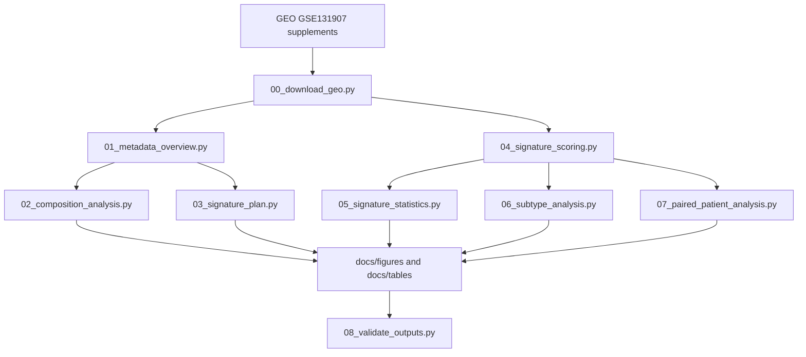

# Methods Overview

This page gives a compact view of the analysis workflow. The executable source of truth is in `scripts/`.

## Workflow



## Data Inputs

The workflow uses public GEO supplements for `GSE131907`:

- cell annotation file
- raw UMI matrix
- feature summary file

The normalized log2TPM matrix is listed in `config.yaml` but is not required for the current workflow.

## Metadata Processing

`scripts/01_metadata_overview.py` standardizes:

- sample ID
- patient ID
- tissue site
- broad cell type
- original cell subtype labels

Tissue-site labels are inferred from sample name prefixes, including normal lung, primary tumor, normal lymph node, advanced airway tumor, pleural effusion, and non-smoker lung.

## Composition Analysis

`scripts/02_composition_analysis.py` summarizes:

- cells per sample
- broad cell-type fractions per sample
- broad cell-type fractions per tissue site

This keeps sample structure visible instead of only reporting pooled cell counts.

## Signature Scoring

`scripts/04_signature_scoring.py` avoids loading the full raw matrix into memory.

It uses two passes over the raw UMI matrix:

1. compute total UMI library size per cell
2. extract only genes used in the curated TME signatures

For each captured gene:

```text
log1p(raw_count / cell_library_size * 10000)
```

Signature scores are calculated as the mean transformed expression across genes in each signature.

## Statistical Summaries

`scripts/05_signature_statistics.py` compares selected tissue sites within relevant broad cell compartments.

It reports:

- group sample counts
- group means
- mean difference
- Cohen's d
- Mann-Whitney U p-value
- Benjamini-Hochberg adjusted p-value

## Subtype Summaries

`scripts/06_subtype_analysis.py` summarizes composition and signature scores using the original GEO `Cell_subtype` labels.

This adds biological context to broad TME signals by separating populations such as T-cell states, macrophage subtypes, malignant epithelial cells, AT1/AT2 cells, and tumor-state epithelial labels.

## Paired-Patient Sensitivity Checks

`scripts/07_paired_patient_analysis.py` identifies patients with both reference and contrast tissue contexts.

It reports:

- paired patient count
- mean and median within-patient difference
- Wilcoxon signed-rank p-value
- Benjamini-Hochberg adjusted p-value
- paired patient IDs

These checks are exploratory but help distinguish within-patient patterns from purely between-patient tissue-site comparisons.

## Output Validation

`scripts/08_validate_outputs.py` checks that committed preview outputs are internally consistent.

It validates:

- required figures
- required tables and columns
- key documentation files
- notebook JSON structure
- report links to figures and tables

GitHub Actions runs this validation on push and pull request.
